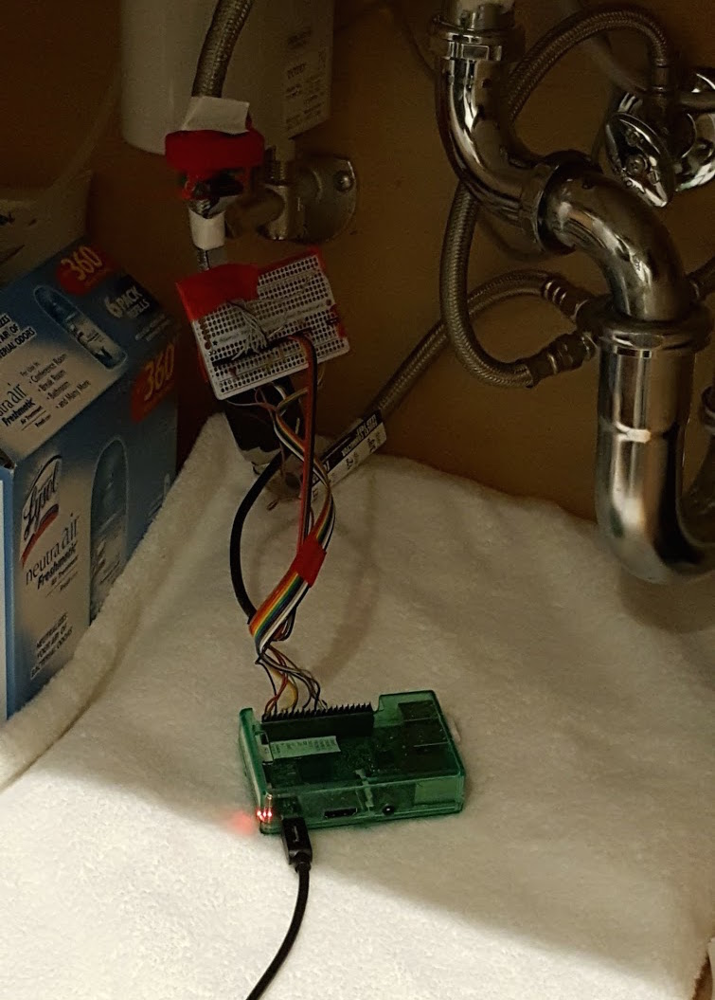
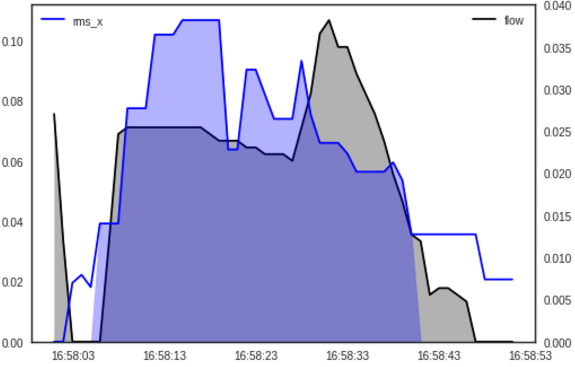

# Applied ML @ LotikLabs

Sayre Blades 

Note:
There will be some physics in this talk, so I hope you are ready.

----------------------------

## Who is Lotik?

[http://samsungnext.com][2]

[http://lotik.com][1]

[1]: http://lotik.com
[2]: http://samsungnext.com

Note:
Lotik is partnerd with samsung next, a global investment initiative
within samsung.  Samsung next start is the division that targets
start ups. They provide lotik resources like: office space, HR, legal,
etc...

(talk about picture)

Lotik is a wireless water intelligence service.
- does anybody pay a water bill?
- why is usage monitoring important?

v---------------------------

## Who are you?

Data Engineer

- software engineer
- devops / architecture
- big data
- machine learning
<!-- .element: class="fragment" data-fragment-index="1" -->
  
Note:
Talk about my background

dont forget:
- machine learning

This is my first professional ML project.

v---------------------------

## Agenda

- Data Collection
- Analysis
- Data Wrangling
- Automation

Note:
You will notice

----------------------------

## Data Collection

v---------------------------

## Data Collection

----------------------------

## Analysis

----------------------------

## Data Wrangling

----------------------------

## Automation

----------------------------

## Thanks

    email: sblades@samsungnext.com
    github: SayreBlades

Note:
If you would like access to these slides feel free
to drop me a line.