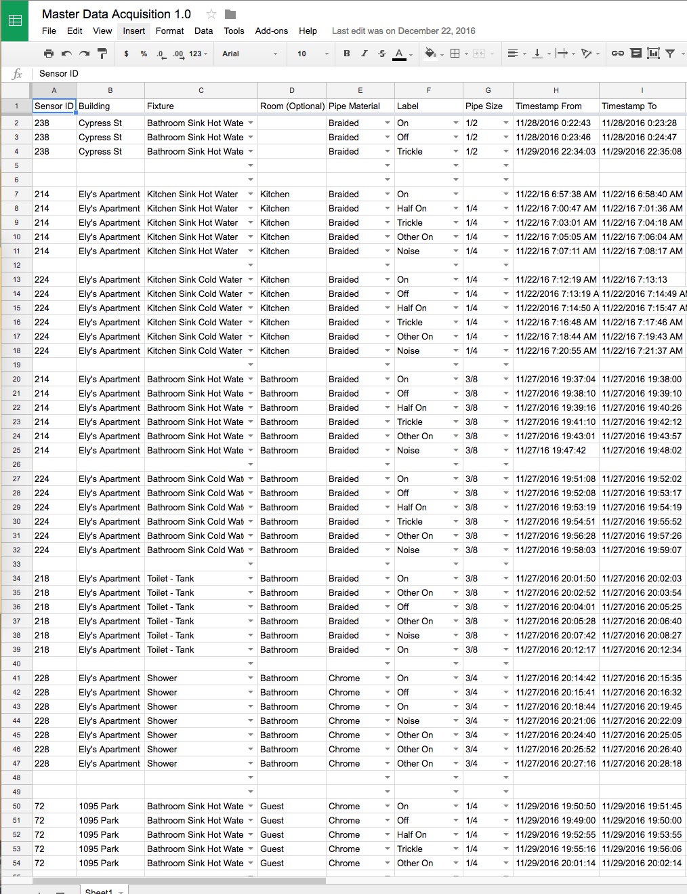
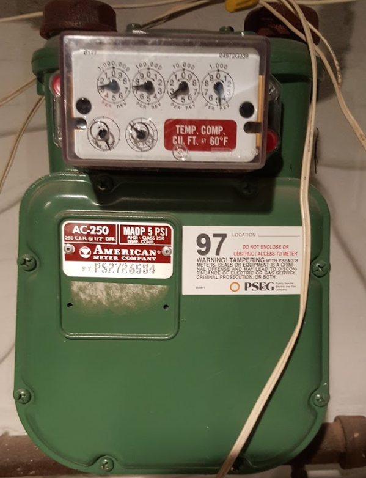
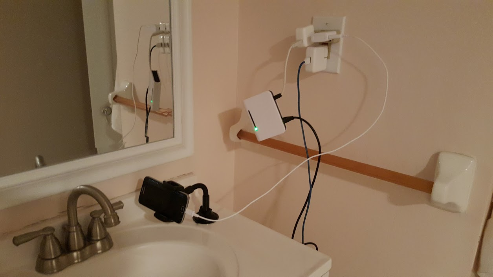
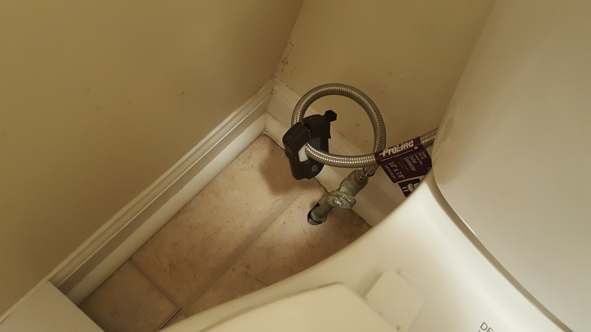
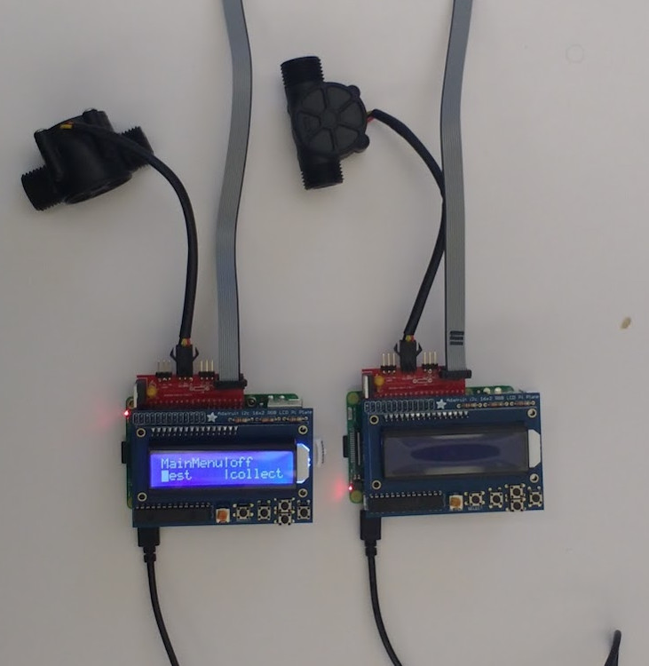
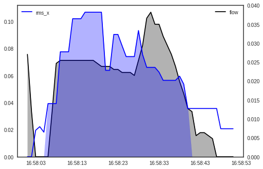
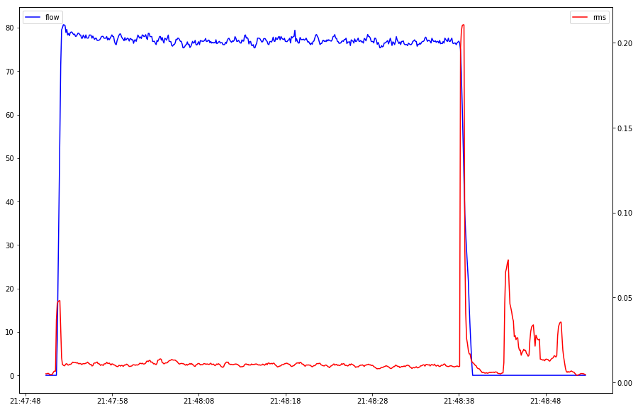
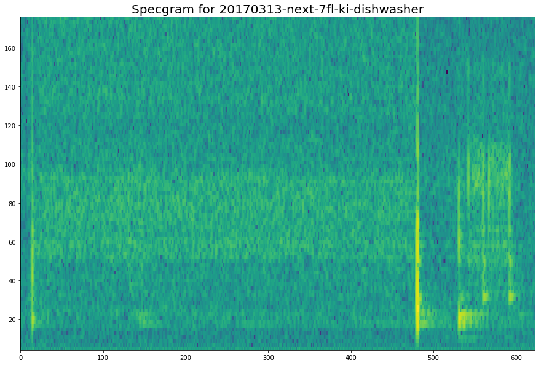
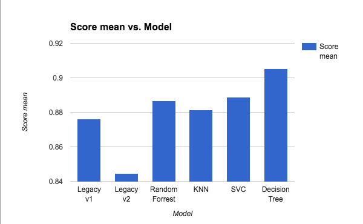

# Applied ML @ LotikLabs

Sayre Blades

Note:

----------------------------

## Who is Lotik?

http://samsungnext.com

http://lotik.com

Note:

(open samsung next link)

Lotik is partnerd with samsung next, a global investment initiative
within samsung.  Samsung next start is the division that targets
start ups. They provide lotik resources like: office space, HR, legal,
etc...

(talk about picture)

(open lotik link)

Lotik is a wireless water intelligence service.
- why is usage monitoring important?
- does anybody pay a water bill?


v---------------------------

## Who are you?

Data Engineer

- app dev
- dev ops 
- architecture
- machine learning
  
Note:
Talk about my background

dont forget:
- machine learning

This is my first professional ML project.

----------------------------

## Lotik's ML Workflow

1. Data Collection <!-- .element: class="fragment grow highlight-current-blue" -->
1. Pre-processing
1. Analysis & Clensing
1. Modeling

Note:

v---------------------------

### First Attempt



Note:

Ground Truth

Classification.

No Fun.


v---------------------------

### Second Attempt





v---------------------------

### Current Attempt



----------------------------

## Lotik's ML Workflow

1. Data Collection
1. Pre-processing <!-- .element: class="fragment grow highlight-current-blue" -->
1. Analysis & Clensing
1. Modeling

Note:

Here I will talk about taking the data in its raw form and
converting it to a format that is consumable by our models.

v---------------------------

### Raw Format

metadata file

				pipe type: braided
				pipe size: 3/8
				  fixture: bath sink auto
	Started collection at: 2017-04-10 14:15:40.098894
               stopped at: 2017-04-10 22:06:31.078903
	 Total number of rows: 11,541,037
				 rows/sec: 408.518111453950

csv data file

	x,y,z,pulses
	-0.8862,0.0303,0.2824,0
	-0.9487,0.0254,0.2882,0
	-0.9555,0.0283,0.3009,0
	-0.9546,0.0244,0.2970,0
	-0.9565,0.0264,0.2941,0
	-0.9516,0.0274,0.3000,1
	...

v---------------------------

### Legacy Model Format

	time     rms_x   rms_y   rms_z    corr    zcr      flow  label
	18:15:49 0.00716 0.00297 0.00522  0.01446 60.00000 0.000 Off
	18:15:50 0.00331 0.00322 0.00552  0.01086 69.33333 0.000 Off
	18:15:51 0.00305 0.00306 0.00578  0.02608 66.00000 0.000 Off
	18:15:52 0.00300 0.00303 0.00584 -0.04534 59.00000 0.000 Off
	18:15:53 0.00334 0.00308 0.00582 -0.05407 54.33333 0.000 Off
	18:15:54 0.00286 0.00302 0.00613 -0.07043 66.33333 0.000 Off
	18:15:55 0.00290 0.00300 0.00584  0.03176 60.00000 0.000 Off
	18:15:56 0.00377 0.00421 0.00650  0.09796 47.00000 0.000 Off
	...

v---------------------------

### Spectrum Model Format

	time               x        y       z      p  ml_bf
	18:15:49.065448999 -0.9399  0.1182  0.3410 0  0.158730
	18:15:49.067896000 -0.9380  0.0840  0.3234 0  0.158730
	18:15:49.070344000 -0.9340  0.0410  0.3097 0  0.158730
	18:15:49.072792000 -0.9663  0.0449  0.2032 0  0.158730
	18:15:49.075240000 -0.9800  0.0274  0.2267 0  0.158730
	18:15:49.077688000 -0.9360  0.0420  0.2228 0  0.158730
	18:15:49.080136000 -0.9106  0.0117  0.2081 0  0.158730
	18:15:49.082584000 -0.9419 -0.0234  0.2237 1  0.158730
	...

----------------------------

## Lotik's ML Workflow

1. Data Collection
1. Pre-processing
1. Analysis & Clensing <!-- .element: class="fragment grow highlight-current-blue" -->
1. Modeling

v---------------------------

### Data Integrity Check

```python
def outliers(row, axis_name='rms_x'):
    label = row['label_label']
    mean_on = row[axis_name + '_mean_on']
    mean_off = row[axis_name + '_mean_off']
    mean = row[axis_name + '_mean']
    
    if label in ['On', 'Half On', 'Other On'] and not is_sgt(mean, mean_off):
        return axis_name + ': < Off'
    elif label == 'Trickle' and is_slt(mean, mean_off):
        return axis_name + ': < Off'
    elif label == 'Other On' and not is_slt(mean, mean_on):
        return axis_name + ': > On'        
    return ''
```

v---------------------------

### Legacy Model Check



(view [notebook](http://localhost:8888/notebooks/inline-flow-meter/gen3-data-visualization.ipynb))

v---------------------------

### Spectrum Model Check






<div style="clear:left;">
(view [notebook](http://localhost:8888/notebooks/inline-flow-meter/generate-specgram.ipynb))
<div>

----------------------------

## Lotik's ML Workflow

1. Data Collection
1. Pre-processing
1. Analysis & Clensing
1. Modeling <!-- .element: class="fragment grow highlight-current-blue" -->

v---------------------------

### Modeling Tools

palladium

https://pypi.python.org/pypi/palladium/

sklearn-porter

https://github.com/nok/sklearn-porter

Note:

(go to website)

Great tool, check it out.

We use it to help automate all of our modeling effort.

v---------------------------

### Model Comparison



----------------------------

## Thanks

    email: sblades@samsungnext.com
    github: SayreBlades

Note:
If you would like access to these slides feel free
to drop me a line.
